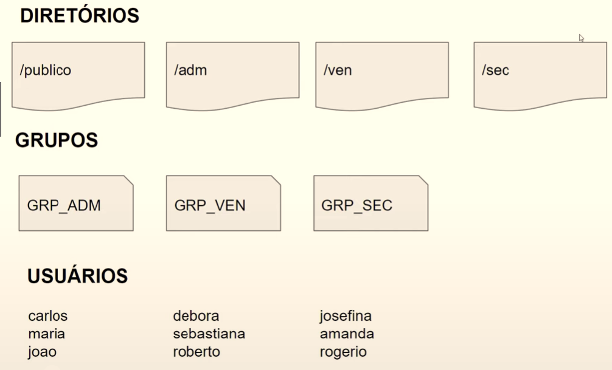

# Infraestrutura como Código: Script de Criação de Estrutura de Usuários, Diretórios e Permissões

Nesse repositório estão contidos os códigos de um dos desafios ocorridos no curso de Linux, parte do Bootcamp **"Jornada DevOps com AWS - Impulso"**, organizada pelo portal [DIO](https://www.dio.me/), no período de outubro a dezembro de 2022. 

## Desafio
Criar a estrutura de diretórios, grupos de usuários e usuários conforme imagem:

### Definições:
* Todo provisionamento deve ser feito em um arquivo do tipo Bash Script;
* O dono de todos os diretórios criados será o usuário root;
* Todos os usuários terão permissão total dentro do diretório **publico**;
* Os usuários de cada grupo terão permissão total dentro de seu respectivo diretório;
* Os usuários não poderão ter permissão de leitura, escrita e execução em diretórios de departamentos que eles não pertencem;
* Subir arquivo de script criado para a sua conta no GitHub.